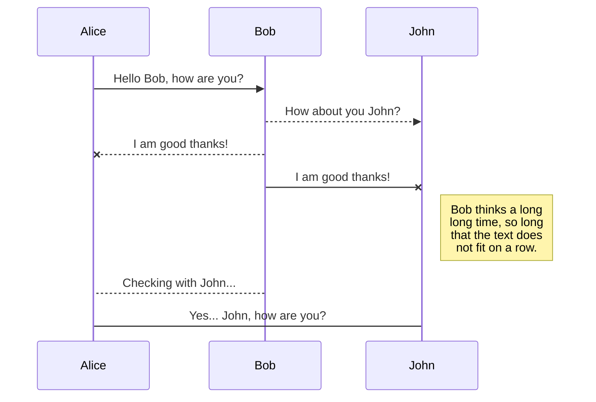
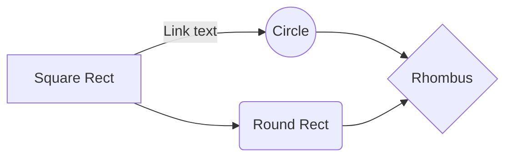

# Rested App Overview
The Rested App has been created for the QA bootcamp practical project. 

## Rested App Proposed Features (M = main feature, A = adventurous personal stretch-goal feature)
- Track daily sleep data (collected using timers). M
- Track daily screen time (user inputted data). M
- Track water consumption, users can set personal limits on intake before bed. A
- Produce weekly reports of user data, including total hours slept and average sleep quality rating (app generated data). M
- Rate sleep quality and make records in dreams journal (user inputted data). M
- Cat Nap vs Night Mode. A
- Cat Nap mode enters a sleep mode for 25 minutes (using timer/alarm integration), app records and adds all Cat Naps to weekly report
- Night Mode records expected majority of user's sleep (daily sleep = tracked sleep using timer - total user absences (minutes) from the night mode)
- Integration with music and podcast streaming services (spotify/apple music integration). A

## Risk Assessment
This outlines the potential issues and risks faced during this project's timeline.

| Description    |Evaluation    |Likelihood     |Impact Level |Responsibility |Response | Control Measures |
|----------------|--------------|---------------|-------------|---------------|---------|------------------| 
|                |              |               |             |               |         |                  |
|                |              |               |             |               |         |                  |
|                |              |               |             |               |         |                  |
|                |              |               |             |               |         |                  |
|                |              |               |             |               |         |                  |
|                |              |               |             |               |         |                  |
|                |              |               |             |               |         |                  |
|                |              |               |             |               |         |                  |
|                |              |               |             |               |         |                  |

## Jira Board
A combination Jira board using Scrum and Kanban features was used for the software development cycle of the Rested App.
> **See Here:** The link to the **Jira board** for this project is just a [click](https://qadfesw3.atlassian.net/jira/software/projects/DPP/boards/1) away. 

# xxxxxxxxx

xxxxxxxxxxxxxxxxxx

## xxxxxxxxxxxxxxxxxxx

xxxxxxxxxxxxxx

## xxxxxxxxxxxxxxx

xxxxxxxxxxxxxxxxxx

> **ProTip:** xxxxxxxxxxxxxxxxxxx

## UML diagrams

> **From Stack Edit:** https://stackedit.io/app#
You can render UML diagrams using [Mermaid](https://mermaidjs.github.io/). For example, this will produce a sequence diagram:

And this will produce a flow chart:

